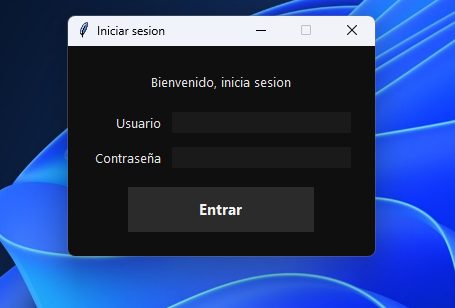
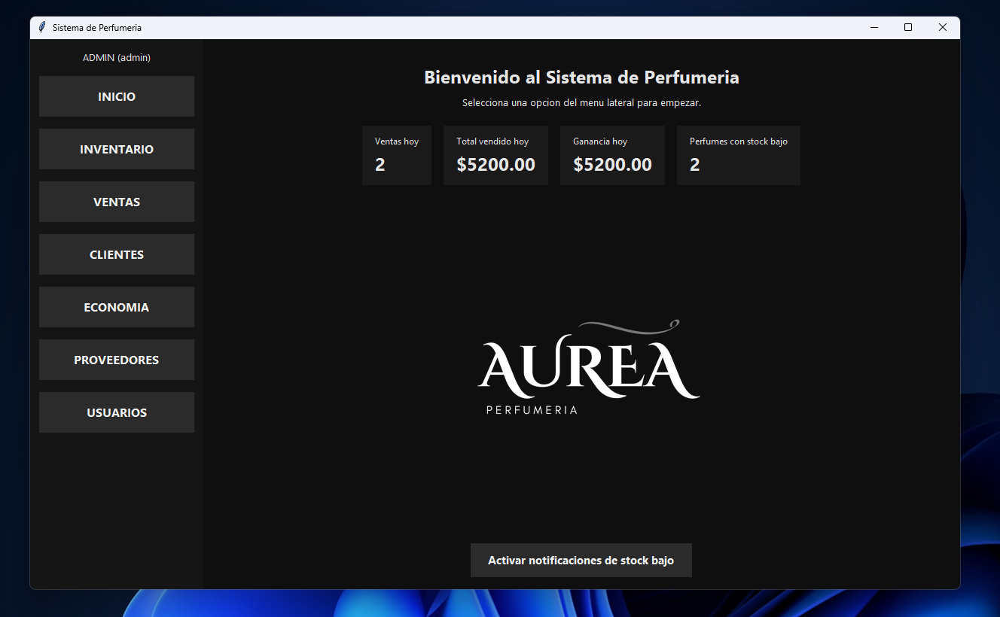
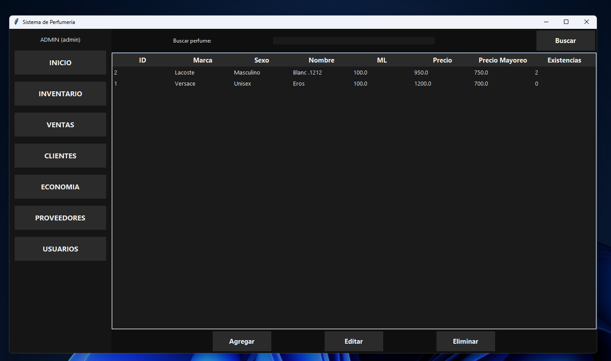
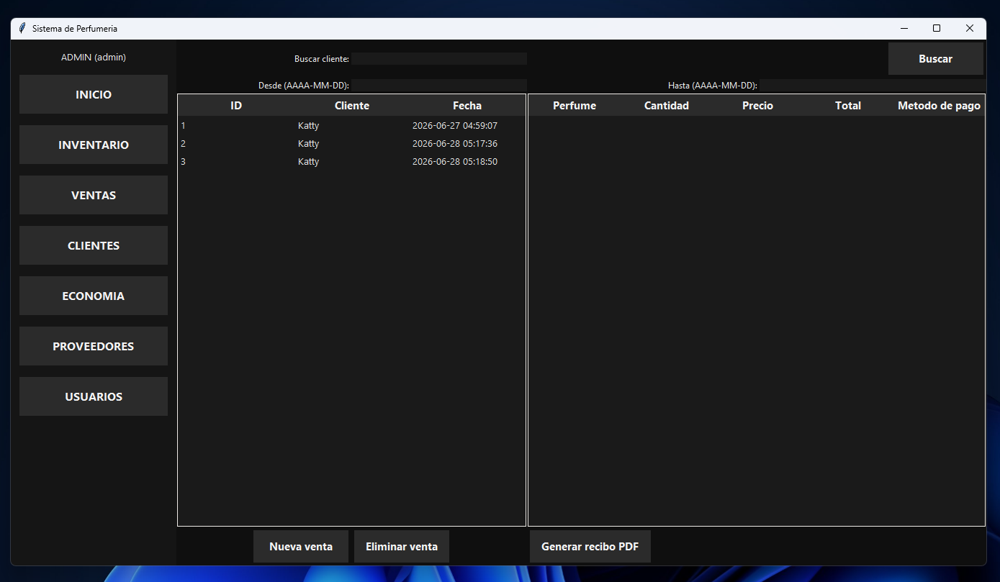
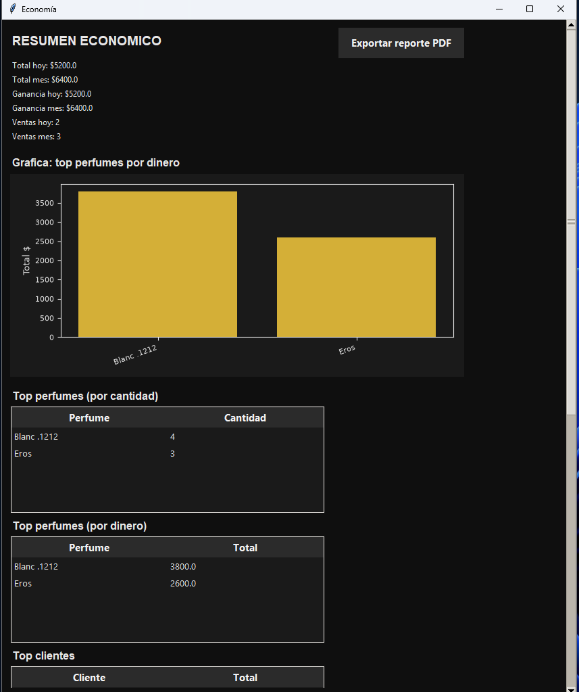
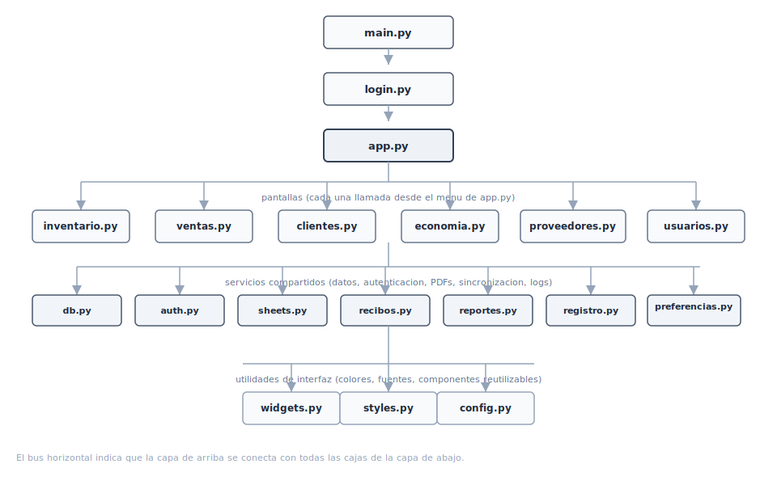
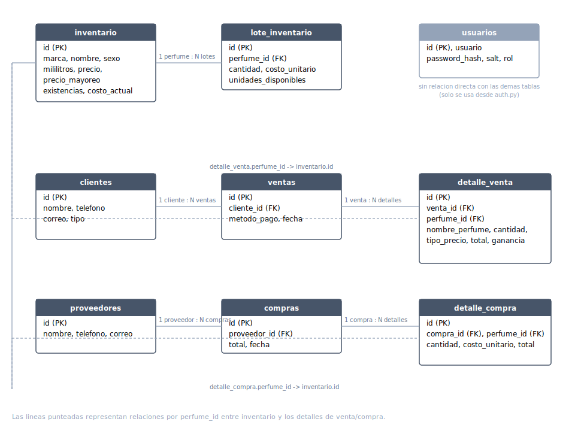
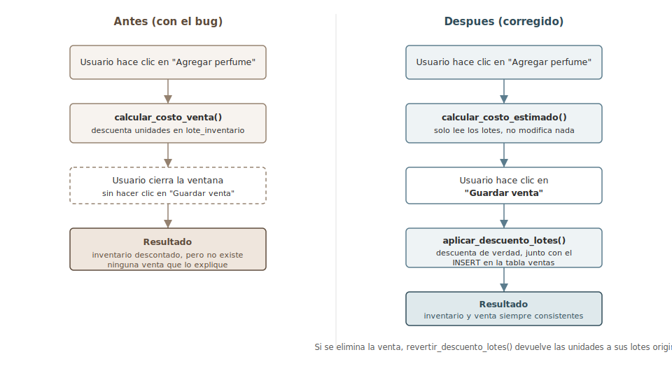

# Perfume Shop Management System


[🇪🇸 Español](README.md) | 🇬🇧 English

This is a desktop application built from the ground up to centralize and simplify the daily operations of a perfume retail business. Far from being a purely theoretical project, the app currently runs in a real environment, unifying inventory control, sales, customers, suppliers, and finances into a single fast and intuitive platform.

https://github.com/user-attachments/assets/3dd34af4-55bd-467b-b520-242004f0a818

## Contents

* [Screenshots](#screenshots)
* [Why this project exists](#why-this-project-exists)
* [Key Features](#key-features)
* [Project Architecture](#project-architecture)
* [Diagrams](#diagrams)
* [Technical Challenges and Solutions](#technical-challenges-and-solutions)
* [Automated Tests](#automated-tests)
* [Technologies Used](#technologies-used)
* [Setup and Running](#setup-and-running)
* [Google Sheets Setup](#google-sheets-setup-optional)
* [Roadmap](#roadmap)
* [FAQ](#faq)
* [Credits](#credits)
* [License](#license)

---

## Screenshots

<table>
<tr>
<td></td>
<td></td>
</tr>
<tr>
<td></td>
<td></td>
</tr>
<tr>
<td colspan="2"></td>
</tr>
</table>

---

## Why this project exists

Before this system was implemented, the business managed all of its information manually. That created the typical problems of any small business: constant errors when calculating net profit (since the same product was bought at different times at different costs), and hours lost going through handwritten notes just to check available stock, identify repeat customers, or balance the day's cash register.

The main goal was to automate these operational tasks and hand strategic control back to the business owner through a tool that's fast, clean, and easy to adopt.

---

## Key Features

### Access control and user security

The system protects business information through login credentials and supports two clearly defined roles:

* **Admin**: Full privileges to manage settings, modify prices, and review the business's finances.
* **Salesperson**: Access scoped to daily operations only (sales and lookups), with critical actions like price changes or record deletion restricted.

**Technical detail:** Passwords are protected using modern standards — hashing plus a per-user salt — instead of plain text.

---

### Home dashboard with at-a-glance information

As soon as the app opens, the user gets an immediate visual snapshot of the business: total sold, today's profit, and a count of items running low on stock. The low-stock alert has its own on/off switch right on that same screen, so it can be toggled depending on the workflow.

---

### Smart inventory management

Lets you register, update, and remove products individually, with a name search that finds any perfume in seconds — no more slow lookups through paper or spreadsheets.

---

### Accurate sales with real cost tracking

Every transaction transparently records the payment method, the price tier applied (regular, wholesale, or custom), and the quantity sold. The full history can be filtered by customer or by date range for quick audits without scrolling through everything. This module lets you evaluate the real profit margin of each sale with precision.

---

### Customer tracking and loyalty

The system lets you create customer profiles and check their full purchase history — a great tool for spotting buying patterns and rewarding your most loyal customers.

---

### Supplier control and traceability

Every purchase registered from a supplier automatically creates new inventory batches tied to their specific acquisition cost. That information is what the system later uses to keep the finances accurate.

---

### Full finance and analytics module

Built for data-driven decision making, this panel offers advanced indicators such as:

* Daily and monthly sales performance and profit.
* Best-seller ranking and detection of slow-moving products.
* Top customers by volume.
* **Stock-out prediction:** The system evaluates each perfume's sales velocity over the last 30 days to project how many days of inventory are left before it runs out.

It includes visual charts and a dedicated button to export the entire financial summary as a professional PDF report.

---

### Digital receipts

From the sales screen, PDF receipts can be generated instantly, breaking down the brand, quantity, price tier applied, and total for the customer.

---

### Cloud sync with Google Sheets (Optional)

For extra flexibility, the system can automatically send data to a Google spreadsheet. This task runs in the background so the interface never freezes or slows down. If there's no connection or the API isn't configured, the software just keeps working locally without any performance hit.

---

### Automated backups and technical auditing

Data integrity is critical. The system creates a backup copy in the `backups/` folder every time the app starts, or before running a deletion. If a technical issue comes up, the error is quietly logged to `logs/app.log` to make diagnosis fast without interrupting the user's experience.

---

## Project Architecture

The code is structured around a modular approach, where each component has a single, isolated responsibility, making the software easier to maintain and scale:

| File / Folder | Purpose and Responsibility |
|---|---|
| `main.py` | Main entry point and global exception handler. |
| `app.py` | Main window control, routing, and the home dashboard. |
| `config.py` | System constants, color palette, and fonts. |
| `db.py` | SQLite database management, schemas, and backups. |
| `auth.py` / `login.py` | Session handling, security, and initial admin account creation. |
| `usuarios.py` | Staff management, registration, and permissions. |
| `preferencias.py` | Local persistence of user preferences. |
| `recibos.py` / `reportes.py` | PDF design and export engines (fpdf2). |
| `registro.py` | Logging system configuration and formatting. |
| `sheets.py` | Integration logic and communication with the Google API. |
| `styles.py` / `widgets.py` | ttk interface styling and reusable visual components. |
| `inventario.py`, `ventas.py`, etc. | Screens and business logic for each part of the system. |
| `tests/` | Automated test suites. |

---

## Diagrams

**General architecture** — which module depends on which:



**Data model** — main tables and their relationships:



**FIFO bug flow** — how it worked before and after the fix (see next section):



---

## Technical Challenges and Solutions

### The challenge of real costing with FIFO

Calculating profit based on average cost tends to distort a business's real financial health when supplier prices fluctuate. To solve this, I implemented the FIFO (First In, First Out) algorithm. The system tracks each inventory batch separately; when processing a sale, units are deducted from the oldest batch in stock first, which allows the profit margin to be calculated far more precisely than with an average cost.

### The "Phantom Inventory" problem and data consistency

During development, a critical issue was found: products were being subtracted from inventory as soon as they were added to a sale's temporary cart. If the user cancelled the transaction halfway through, the stock had already changed, creating serious discrepancies between the physical products and the database.

The fix was redesigning the flow into two atomic stages:

* `calcular_costo_estimado()`: Reads the inventory using FIFO logic and produces a preview of the total cost and simulated profit, without touching the database.
* `aplicar_descuento_lotes()`: Permanently updates the inventory and consolidates the batches only once the sale is confirmed and safely recorded.

In addition, a `revertir_descuento_lotes()` routine was built to restore units back to their original batches exactly if a confirmed sale is later deleted from the history. Validations were also added to prevent empty or invalid fields (text instead of numbers, for example) from causing unexpected crashes.

---

## Automated Tests

To guarantee the reliability of the system's core, the project includes unit tests that validate:

* The exact behavior of the FIFO costing algorithm across different purchase and sale scenarios.
* The authentication flow and role-based security restrictions.

These tests use an in-memory SQLite database (`:memory:`), fully isolating the test environment from real business data. They're also wired into a Continuous Integration (CI) pipeline via GitHub Actions, running automatically on every push to the repository.

To run the tests locally:

```bash
pip install pytest
python -m pytest tests/ -v
```

---

## Technologies Used

* **Language:** Python 3
* **GUI:** Tkinter / ttk
* **Database:** SQLite
* **Cloud Integration:** gspread and Google Service Account
* **Reporting and Visuals:** fpdf2, matplotlib, and Pillow

---

## Setup and Running

To run the project locally, install the dependencies and start the main file:

```bash
pip install -r requirements.txt
python main.py
```

**Note on the interface:** The system looks for a file named `Image.png` to use as the welcome screen. If it's not found, the app is designed to handle the error gracefully and keep working normally.

**Note on the cloud:** The `credenciales.json` file is only needed if you want to enable Google Sheets sync. If it's not included, the system skips that step and works locally without any issue.

---

## Google Sheets Setup (Optional)

If you want to enable automatic cloud backup, follow these steps:

1. Create a project in Google Cloud Console.
2. Enable the Google Sheets and Google Drive APIs for that project.
3. Create a Service Account and download its credentials file in JSON format.
4. Rename the downloaded file to `credenciales.json` and place it in the root directory, alongside `main.py`.
5. Open your Google spreadsheet and share it with the email address generated for the Service Account, granting it Editor access.

If the credentials are missing or invalid, the system is designed to keep running locally without interrupting business operations.

---

## Roadmap

Things I have in mind for future versions, with no fixed date yet:

* Export the full inventory to a local Excel/CSV file, without relying on Google Sheets.
* Allow registering orders with multiple perfumes from different suppliers in a single purchase.
* A more detailed user manual, with step-by-step screenshots of each screen.
* Package the app as a `.exe` with PyInstaller for distribution without requiring a Python install.

---

## FAQ

**Does it work without an internet connection?**
Yes. Google Sheets sync is completely optional; without it, the app works the same using only the local database.

**What happens if I lose or corrupt the database?**
The system automatically creates backups in the `backups/` folder every time the app starts and before any deletion. You can restore the most recent one by replacing the current `.db` file with a copy from that folder.

**How do I recover the admin password if I forget it?**
There's currently no in-app recovery flow. The most direct way is to open the SQLite database (`perfumeria.db`) and manually delete the corresponding row in the `usuarios` table, which makes the app prompt for a new admin account on the next start.

**Can I use this for a different kind of business, not just a perfume shop?**
The FIFO costing, user roles, PDF receipts, and backups are generic and work for any business that sells products by batch. What is hardcoded to the perfume domain is the inventory fields (brand, milliliters, etc.) in `db.py` and `inventario.py`.

**Why Tkinter and not a more modern framework?**
Because it ships with Python, requires no extra installation for the end user, and is more than enough for the size of this app.

---

## Credits

Built by [KGcodexX](https://github.com/KGcodexX). Special thanks to the person who actually uses this app every day in her business — without that real use case, this project would still just be a theoretical exercise.

---

## License

This project is distributed under the MIT license. You're free to use it, modify the code, and distribute it for both academic and commercial purposes.
